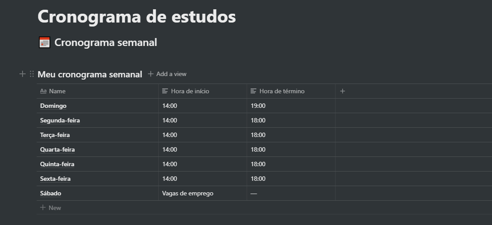

<h3 align="center">
  Desafio 1: Planejando meus estudos
</h3>

“Sua única limitação é você mesmo”!</blockquote>

## :rocket: Sobre o desafio

Nesse desafio, eu crie o meu cronograma semanal e diário, para planejar os meus estudos.

Para isso, usei a ferramenta Notion [página oficial](https://www.notion.so/product).

### 📅 Cronograma:

## 📅 Definindo o cronograma diário

  

[Calendário de estudos](https://www.notion.so/19d43648f83546f08bceac8e9a03aac8)

## 📅 Definindo Cronograma semanal

  

[Meu cronograma semanal](https://www.notion.so/d083b26698b5446aad5e02613767837e)

